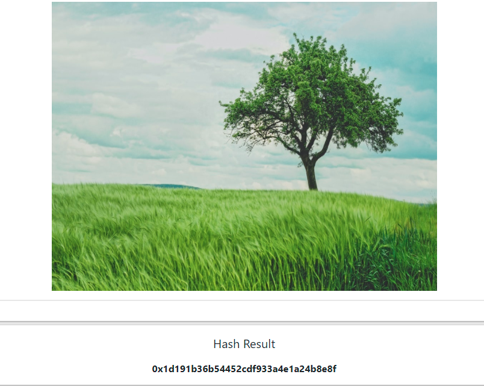
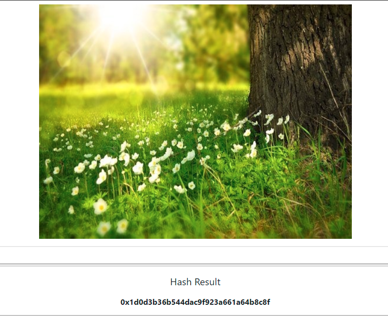
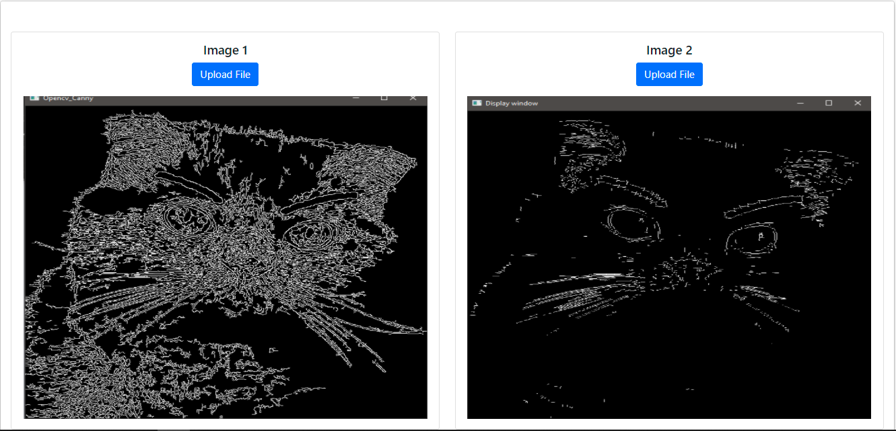
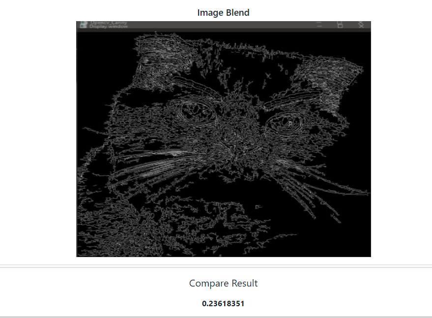

# **Image Deep Hash**
**Information Integrity Checking** is one of the important uses of hash functions. However, current hash functions such as **SHA**, **MD**, etc. only tell us the integrity of the file, but do not tell us how much the information has changed.

---

For an image that only needs to be 1 pixel different, the hash results will be completely different. In some cases like loading a 60fps video and only 1 frame is 1 pixel wrong, reloading is too expensive. We overcome that problem by extracting features of the image to evaluate the difference between the downloaded image and the original image and then make a decision whether it is necessary to reload or not. However, the solution also has limitations in having high time and space complexity.

## 🌟 **Run on localhost (require CUDA)**
- Clone the repo
```
git clone https://github.com/lannguyen0910/image-deep-hash
cd image-deep-hash/
```
- Install dependencies
```
pip install -r requirements.txt
```
- Start the app
```
python app.py --host=localhost:3000
```

## 🌟 **Run using Google Colab**
Open notebook and follow the instructions [](https://colab.research.google.com/drive/1N2AyKf_G8ImdRdpgpzLbyQf0PgH7jwlt?usp=sharing)

## 🌟 **Deep Hash**
Hash an image and return to a hash sequence which its hex length is modifiable. Go to <a href="https://github.com/lannguyen0910/image-deep-hash/examples/hash/hash_tutorial.ipynb">hash_tutorial</a> and <a href="https://github.com/lannguyen0910/image-deep-hash/src/ImageDeepHash.py">hash_module</a> for more information

ex1 | ex2
--- | ---
 | 

## 🌟 **Deep Compare**
Hash 2 images and evaluate the difference using some appropriate metrics for comparision. Go to <a href="https://github.com/lannguyen0910/image-deep-hash/examples/compare/compare_tutorial.ipynb">compare_tutorial</a> and <a href="https://github.com/lannguyen0910/image-deep-hash/src/ImageDeepCompare.py">compare_module</a> for more information

input1 | result1
--- | ---
 | 

input2 | result2
--- | ---
 | 
